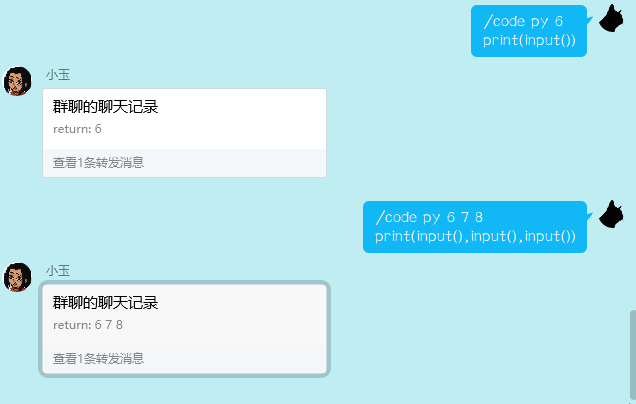

<p align="center">
  <a href="https://v2.nonebot.dev/"></a>
</p>

<div align="center">

**你的star是我的动力**
**↓**


# 在线运行代码<_ （备考中 可能会更新）

_✨ NoneBot2 在线运行代码<_ ✨_

</div>

取自某个仓库（但实际我忘了是哪儿了），修改增加了输入功能

运行于 [https://glot.io/](https://glot.io/)

## 安装💿

`nb plugin install nonebot-plugin-code`


## 更新日志

0.0.5
 [@Limnium](https://github.com/Limnium)
- 更新了正则的pattern（应该能完美按预期匹配）
- 删去命令中的`-i`使其更简洁
- 完善了返回消息
- 以合并转发的方式发送返回消息

0.0.4
- 更新依赖

0.0.3

- 适配b1
- 异步httpx

0.0.2

## 指令💻

```
code [语言] [inputText(空格将被转换为回车)]
[代码]

运行代码示例(python)(无输入)：
    code py
        print("sb")
运行代码示例(python)(有输入)：
    code py 你好
        print(input())
```

## 截图🖼

`尚为旧版本截图`


**给个star吧~**

其他插件
[（不）简易群管](https://github.com/yzyyz1387/nonebot_plugin_admin)
[在线运行代码](https://github.com/yzyyz1387/nonebot_plugin_code)
[工作性价比](https://github.com/yzyyz1387/nonebot_plugin_workscore)
[黑丝插件（停止维护）](https://github.com/yzyyz1387/nonebot_plugin_heisi)


